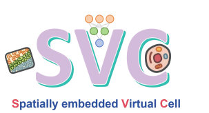

# SVC

**SVC (Spatially embedded Virtual Cell)** is a Vision Transformer-based Spatial Virtual Cell Model for Deciphering Subcellular Spatial Transcriptomic Heterogeneity.



---

## Installation

### 1. Clone the repository

```bash
git clone https://github.com/aster-ww/SVC.git
cd SVC
```
### 2.  Create the conda environment
```bash
conda env create -f environment.yml
conda activate SVC
```
---
## Documentation

**Full documentation and tutorials** are available on [readthedocs page](https://svc.readthedocs.io/)

The documentation includes:
- Project overview
- Installation instructions
- API reference
- Data preprocessing
- Model usage examples

---
## Data availability

Example datasets used in this project are publicly available:

- **[SeqFISH+](https://www.nature.com/articles/s41586-019-1049-y)**  
  
- **[MERFISH](https://www.pnas.org/doi/10.1073/pnas.1612826113)**  
  
- **[Xenium human breast cancer](https://www.nature.com/articles/s41467-023-43458-x)** 
  
- **[Xenium mouse brain](https://www.10xgenomics.com/datasets/fresh-frozen-mouse-brain-replicates-1-standard)**

- **[Xenium Prime 5K mouse brain hemishpere](https://www.10xgenomics.com/datasets/xenium-prime-fresh-frozen-mouse-brain)**

Processed data, saved checkpoints, and main outputs used in our project can be downloaded via [https://drive.google.com/drive/folders/1G4Nl-As6hXsAh7vHaRJ3vkYv44A-mU5f](https://drive.google.com/drive/folders/1G4Nl-As6hXsAh7vHaRJ3vkYv44A-mU5f).

---
Visit our [group website](https://xiangzhou.github.io/) for more statistical tools on analyzing genetics, genomics and transcriptomics data.
