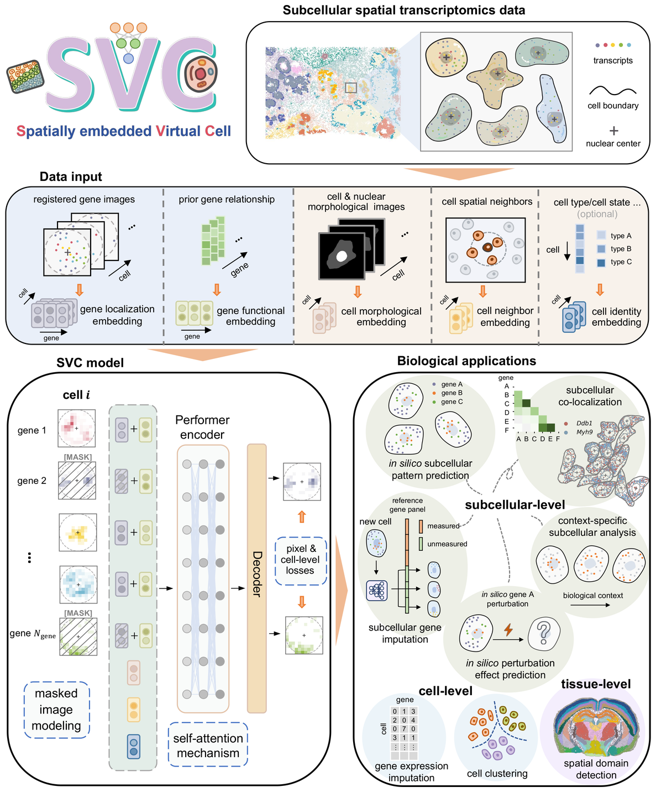

# SVC

**SVC: A Vision Transformer-based Spatial Virtual Cell Model for Deciphering Subcellular Spatial Transcriptomic Heterogeneity**

Hui Wan, Penghui Yang, Siyu Hou, Jade Xiaoqing Wang and Xiang Zhou\*

---

## 🔬 Overview

SVC is a unified artificial intelligence (AI)-based predictive model for subcellular-resolution spatial transcriptomics (ST) that captures and predicts the subcellular localization of transcripts within individual cells in their spatial tissue context. It builds upon a Vision Transformer (ViT)-based framework that enables multi-modal and multi-scale modeling of subcellular ST data. SVC integrates subcellular transcript localization with cell-level identity and morphological features, while also preserving microenvironment context at the tissue level. In addition, it incorporates prior biological knowledge about gene functional relationships learned from external transcriptomic datasets, while naturally accommodating network connectivity across genes. SVC enables spatially grounded virtual representations of individual genes and cells, which is essential for an integrated understanding of cellular function.



---
## 🧩 Applications

**Subcellular level**
- *In silico* subcellular pattern prediction for unmeasured genes
- Subcellular gene imputation in new datasets, gene panels, tissues and disease conditions
- Subcellular gene-gene co-localization within individual cells
- Context-specific subcellular analysis across cell states, cell types and microenvironments
- *In silico* perturbation effect prediction at subcellular resolution

**Cell and tissue level**
- Cell-level gene expression imputation
- Cell clustering
- Spatial domain detection

&emsp;&emsp;&emsp;&emsp;&emsp;&emsp;•<br>&emsp;&emsp;&emsp;&emsp;&emsp;&emsp;•<br>&emsp;&emsp;&emsp;&emsp;&emsp;&emsp;•

---

## ⚙️ Installation

### 1. Clone the repository

```bash
git clone https://github.com/aster-ww/SVC.git
cd SVC
```
### 2.  Create the conda environment
```bash
conda env create -f environment.yml
conda activate SVC
```

Using GPUs is highly recommended. Installation typically takes 10 to 20 minutes.

---
## 📖 Documentation

**Full documentation and tutorials** are available on [readthedocs page](https://svc.readthedocs.io/)

The documentation includes:
- Project overview
- Installation instructions
- API reference
- Data preprocessing
- Model usage examples

---
## 💾 Data availability

The original datasets used in this project are publicly available:

- **[seqFISH+ mouse embryonic fibroblast (NIH/3T3)](https://doi.org/10.6084/m9.figshare.15109236)**

- **[MERFISH human osteosarcoma (U2-OS)](https://doi.org/10.6084/m9.figshare.15109236)**

- **[Xenium mouse brain](https://www.10xgenomics.com/datasets/fresh-frozen-mouse-brain-replicates-1-standard)**

- **[Xenium human breast cancer](https://www.10xgenomics.com/products/xenium-in-situ/preview-dataset-human-breast)**

- **[Xenium Prime 5K mouse brain hemisphere](https://www.10xgenomics.com/datasets/xenium-prime-fresh-frozen-mouse-brain)**

- **[Xenium Prime 5K P301S tauopathy mouse brain](https://www.ncbi.nlm.nih.gov/geo/query/acc.cgi?acc=GSE330686)**

- **[Xenium human lung cancer](https://www.10xgenomics.com/datasets/preview-data-ffpe-human-lung-cancer-with-xenium-multimodal-cell-segmentation-1-standard)**

- **[MERFISH mouse brain](https://download.brainimagelibrary.org/29/3c/293cc39ceea87f6d/)**

Processed data and the trained model checkpoints used in our project are deposited on Zenodo: [https://doi.org/10.5281/zenodo.22693727](https://doi.org/10.5281/zenodo.22693727).

---
## 🔁 Reproducibility

Code for reproducing the main figures of the manuscript is available at [https://github.com/aster-ww/SVC-reproducibility](https://github.com/aster-ww/SVC-reproducibility), where each figure has a notebook together with the precomputed files it reads.

---
## ✉️ Contact

For any questions, please contact Hui Wan (hui.wan@yale.edu).

---
Visit our [group website](https://xiangzhou.github.io/) for more statistical tools on analyzing genetics, genomics and transcriptomics data.
