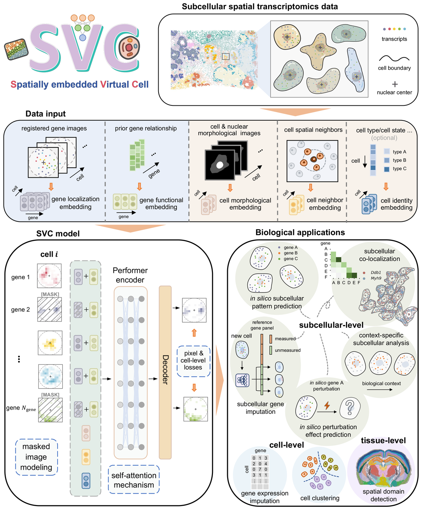

# SVC

**SVC: A Vision Transformer-based Spatially and Virtually Embedded Cell Model for Deciphering Subcellular Spatial Transcriptomic Heterogeneity**

Hui Wan, Penghui Yang, Siyu Hou, Jade Xiaoqing Wang and Xiang Zhou\*

---

## 🔬 Overview

SVC is a Vision Transformer (ViT)-based spatially and virtually embedded cell model for subcellular-resolution spatial transcriptomics (ST). It represents each gene's subcellular localization as an image patch and uses the other genes within the same cell as context, enabling subcellular contextual learning of the spatial dependencies that govern intracellular transcript organization. By integrating gene-function priors, cell morphology, spatial context, and, when available, cell identity, SVC captures unified, spatially grounded representations across genes and cells that connect subcellular organization to cellular state and tissue microenvironment. These representations support prediction of cell-specific subcellular transcript localization and co-organization, subcellular imputation of unmeasured genes, *in silico* perturbation, and transfer to cell- and tissue-level tasks.



---
## 🧩 Applications

**Subcellular level**
- *In silico* subcellular pattern prediction for unmeasured genes
- Subcellular gene imputation in new datasets, gene panels, tissues and disease conditions
- Subcellular gene-gene co-localization within individual cells
- Context-specific subcellular analysis across cell states, cell types and microenvironments
- *In silico* perturbation effect prediction at subcellular resolution

**Cell and tissue level**
- Cell-level gene expression imputation
- Cell clustering
- Spatial domain detection

&emsp;&emsp;&emsp;&emsp;&emsp;&emsp;•<br>&emsp;&emsp;&emsp;&emsp;&emsp;&emsp;•<br>&emsp;&emsp;&emsp;&emsp;&emsp;&emsp;•

---

## ⚙️ Installation

### 1. Clone the repository

```bash
git clone https://github.com/aster-ww/SVC.git
cd SVC
```
### 2.  Create the conda environment
```bash
conda env create -f environment.yml
conda activate SVC
```

Using GPUs is highly recommended. Installation typically takes 10 to 20 minutes.

### Requirements

All versions are pinned in [`environment.yml`](environment.yml). The released results were produced with **Python 3.10.19** and:

| Package | Version | Package | Version |
|---|---|---|---|
| torch | 2.5.1 | pandas | 2.2.3 |
| einops | 0.8.1 | anndata | 0.11.4 |
| local-attention | 1.9.15 | tqdm | 4.66.5 |
| numpy | 1.26.4 | natsort | 8.4.0 |
| scipy | 1.12.0 | scikit-learn | 1.7.2 |

`environment.yml` also pins the packages the figure notebooks in [SVC-reproducibility](https://github.com/aster-ww/SVC-reproducibility) use: ipykernel 7.1.0, matplotlib 3.9.2, seaborn 0.13.2, networkx 3.4.2, umap-learn 0.5.6, scanpy 1.10.3 and openpyxl 3.1.5.

---
## 📖 Documentation

**Full documentation and tutorials** are available on [readthedocs page](https://svc.readthedocs.io/)

The documentation includes:
- Project overview
- Installation instructions
- API reference
- Data preprocessing
- Model usage examples

---
## 💾 Data availability

The original datasets used in this project are publicly available:

- **[seqFISH+ mouse embryonic fibroblast (NIH/3T3)](https://doi.org/10.6084/m9.figshare.15109236)**

- **[MERFISH human osteosarcoma (U2-OS)](https://doi.org/10.6084/m9.figshare.15109236)**

- **[Xenium mouse brain](https://www.10xgenomics.com/datasets/fresh-frozen-mouse-brain-replicates-1-standard)**

- **[Xenium human breast cancer](https://www.10xgenomics.com/products/xenium-in-situ/preview-dataset-human-breast)**

- **[Xenium Prime 5K mouse brain hemisphere](https://www.10xgenomics.com/datasets/xenium-prime-fresh-frozen-mouse-brain)**

- **[Xenium Prime 5K P301S tauopathy mouse brain](https://www.ncbi.nlm.nih.gov/geo/query/acc.cgi?acc=GSE330686)**

- **[Xenium human lung cancer](https://www.10xgenomics.com/datasets/preview-data-ffpe-human-lung-cancer-with-xenium-multimodal-cell-segmentation-1-standard)**

- **[MERFISH mouse brain](https://download.brainimagelibrary.org/29/3c/293cc39ceea87f6d/)**

- **[Pretrained Gene2vec vectors](https://drive.weixin.qq.com/s?k=AJEAIQdfAAozQt5B8k)**

Processed data and the trained model checkpoints used in our project are deposited on Zenodo: [https://doi.org/10.5281/zenodo.22693727](https://doi.org/10.5281/zenodo.22693727).

---
## 🔁 Reproducibility

Code for reproducing the figures in the manuscript is available at [https://github.com/aster-ww/SVC-reproducibility](https://github.com/aster-ww/SVC-reproducibility), where each figure has a notebook together with the precomputed files it reads.

---
## ✉️ Contact

For any questions, please contact Hui Wan (hui.wan@yale.edu).

---
Visit our [group website](https://xiangzhou.github.io/) for more statistical tools on analyzing genetics, genomics and transcriptomics data.
